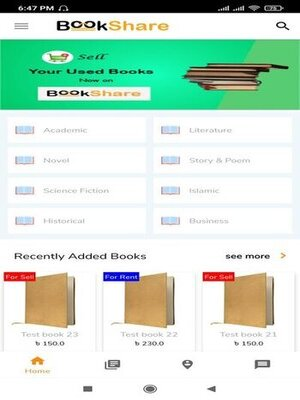
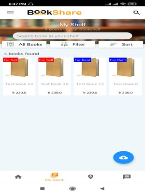
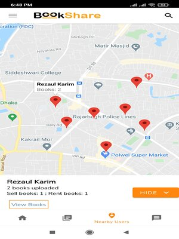

### Location Based Book sharing Android Application
___
### Programming Languages:
* **Back-End:** Java
* **Library/API:** PHP script for API (Handling
CRUD operation), Volley Library
* **Database:** MySQL
* **Hosting:** cPanel
___
### **Description:**
A location based book sharing application where user can sell or provide rental service to others with their own books. A successful registered user can upload their own books information (Images, price, condition, Author) to their profile.\
The most noticable feature is that it is a location based service so that the user can share their books with nearest located user. A fully functional google map is implemented by using google's API. 
___
### **Features / Objectives**
* User can sign up and organize
their own profile. The can upload the necessary information about their own collection of
books category wise.
* User can see the nearest user who is willing to share books through locate user
option. They can visit that person's profile to see their book collection.
* User can view their income information collected through book renting.
* The app will provide rent history, user reviews, requested books list.
___
### **Screenshots:**

___

___
